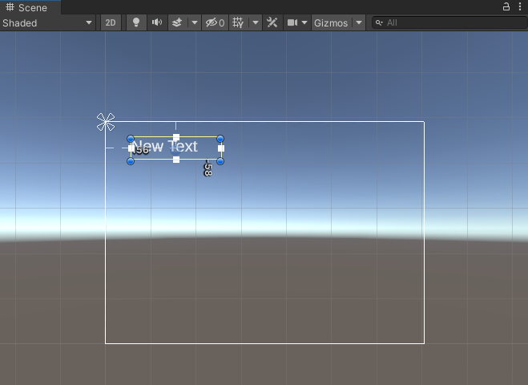

Right-click in the Hierarchy window, or on the GameObject that you want the text to be a child of, and go to ‘UI’ then select ‘Text - TextMeshPro’. 

This creates a Canvas with child TextMeshPro object, you can see the text in the **Game view**.

**Tip:** Tip: You can view the position of the text in the Game view even when you are not in Playmode.

It's a good idea to rename the text so you will be able to identify it later. Right-click on the new Text - TextMeshPro GameObject and select rename.

Change the text displayed by the TextMeshPro in the Inspector:

Select the TeshMeshPro GameObject to adjust its settings in the Inspector:

This example would position the centre of your text 120 pixels from the left and -50 pixels from the top, and anchor it to the top-left.

**Tip:** Anchoring the text will make it appear in the correct position if you resize your Game view. 

You can also add and position 'Button - TextMeshPro' objects in the same way. The text displayed on a button is child object of the Button. 

You can also click '2D' at the top of the Scene view to see the text. Click on the Canvas containing your TextMeshPro in the hierarchy and use 'Shift-F' to focus on it. Click on your TextMeshPro in the Hierarchy and then drag the it into position in the Scene view. Click 2D again to return to 3D mode. 

{ max-width: 400px;}

**Tip:** When positioning buttons in 2D view, make sure you have the Button selected, not just it's text child object.
