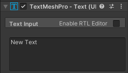

Right-click in the Hierarchy window, or on the GameObject that you want the text to be a child of, and go to **UI** then select **Text - TextMeshPro**.

This creates a Canvas with child TextMeshPro object; you can see the text in the Game view.

**Tip:** You can view the position of the text in the Game view even when you are not in Play mode.

C'est une bonne idée de renommer le texte pour pouvoir l'identifier plus tard. Fais un clic droit sur le nouveau GameObject TextMeshPro et sélectionne rename.

Modifie le texte affiché par le TextMeshPro dans l'Inspector :

Select the TextMeshPro GameObject to adjust its settings in the Inspector:

This example would position the centre of your text 120 pixels from the left and -50 pixels from the top, and anchor it to the top left.

**Astuce :** ancrer le texte le fera apparaître dans la bonne position si tu redimensionnes ta vue Game.

Tu peux également ajouter et positionner des objets « Button - TextMeshPro » de la même manière. The text displayed on a button is a child object of the Button. 

