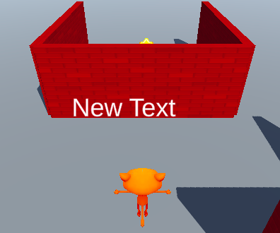

Fais un clic droit dans la fenêtre Hierarchy ou sur le GameObject dont tu veux que le texte soit un enfant, et va sur « UI » puis sélectionne « Text - TextMeshPro ».

Cela crée un Canvas avec un objet TextMeshPro enfant, tu peux voir le texte dans la **vue Game**.

**Astuce :** tu peux voir la position du texte dans la vue Game même lorsque tu n'es pas en mode Play.

C'est une bonne idée de renommer le texte pour pouvoir l'identifier plus tard. Fais un clic droit sur le nouveau GameObject TextMeshPro et sélectionne rename.

Modifie le texte affiché par le TextMeshPro dans l'Inspector :

Sélectionne le GameObject TeshMeshPro pour régler ses paramètres dans l'Inspector :

Cet exemple positionnerait le centre de ton texte à 120 pixels de la gauche et à -50 pixels du haut, et l'ancrerait en haut à gauche.

**Astuce :** ancrer le texte le fera apparaître dans la bonne position si tu redimensionnes ta vue Game.

Tu peux également ajouter et positionner des objets « Button - TextMeshPro » de la même manière. Le texte affiché sur un bouton est un objet enfant du bouton. 

