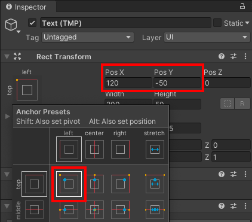

Klik met de rechtermuisknop in het Hierarchy venster, of op het GameObject waar je tekst als onderliggend object wil toevoegen, en ga naar **UI** en selecteer **Text - TextMeshPro**.

Hiermee wordt een canvas gemaakt met het onderliggende TextMeshPro-object, je kunt de tekst zien in Spelweergave.

**Tip:** je kunt de positie van de tekst in de Spelweergave bekijken, zelfs als je niet in de spelmodus bent.

Het is een goed idee om de tekst een andere naam te geven zodat je deze later gemakkelijk kunt terugvinden. Klik met de rechtermuisknop op het nieuwe Text - TextMeshPro GameObject en selecteer rename.

Wijzig de tekst die wordt weergegeven door de TextMeshPro in de Inspector:

Selecteer het TextMeshPro GameObject om de instellingen aan te passen in de Inspector:

Dit voorbeeld zou het midden van de tekst 120 pixels van links en -50 pixels van boven plaatsen, en het aan de linkerbovenhoek verankeren.

**Tip:** Het verankeren van de tekst zal er voor zorgen dat deze op de juiste plaats verschijnt, ook als je de grootte van je spelweergave aanpast.

Je kunt ook 'Button - TextMeshPro' objecten op dezelfde manier toevoegen en positioneren. De tekst die wordt weergegeven op een knop is een onderliggend object van de knop. 

